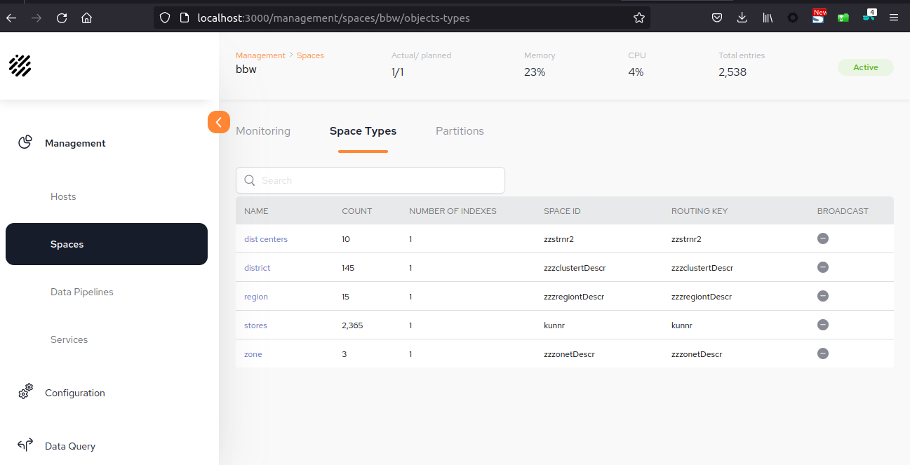
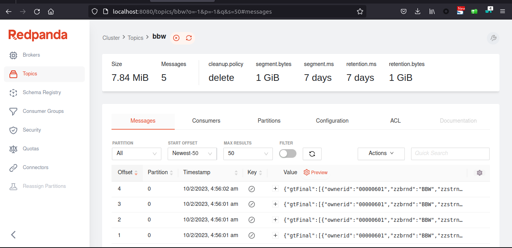

# BBW Kafka Producer + Pluggable Connector

## Summary

Data pipeline to demonstrate data flow from Kafka topic to objects in Gigaspaces.
This example showing json data produced to kafka and other side it is being consumed by pluggable connector which will parse incoming data and create objects to the space in Gigaspaces. 


----------------

## Steps


###1. Create Cluster on AWS EKS

>eksctl create cluster --name bbwkafka --version 1.21 --region eu-west-2  --nodegroup-name standard-workers --node-type t3.large --nodes 3 --nodes-min 1 --nodes-max 3 --tags owner=niharkapadia,project=bbw

###2. Set docker authentication in Kubernetes

>kubectl create secret docker-registry docker-secret   --docker-username=USER --docker-password=PASSWD

###3. Install DI Pipeline Umbrella

>helm repo add dih https://s3.amazonaws.com/resources.gigaspaces.com/helm-charts-dih

>helm install di dih/di-pipeline --version 16.3.0-m5

#### To access Kafka-UI from local (http://localhost:8080)
>kubectl port-forward svc/kafka-ui 8080:8080

#### To access Space deck from local (http://localhost:3000)
>kubectl port-forward svc/spacedeck 3000:3000

####  DEPLOY SPACE	

>helm repo add gigaspaces-repo-ea http://resources.gigaspaces.com.s3.amazonaws.com/helm-charts-ea

>helm install bbw gigaspaces-repo-ea/xap-pu --version 16.3.0-m5

###4. Build BBW-kafka-producer code

> cd BBW-kafka-producer

Note: Edit 'bootstrap.servers' value if you are using other than "kafka:9092" at BBW-Kafka-Producer/src/main/java/com/javatechie/k8s/ProducerCreator.java

> mvn clean install

###5. Build and Push Docker Image
> sudo docker build -t niharkapadia/bbw-kafka-producer:1.0 .

> sudo docker push niharkapadia/bbw-kafka-producer:1.0

###6. Deploy BBW-kafka-producer app to Kubernetes
> kubectl delete deployments bbw-kafka-producer

Note: Edit 'BOOTSTRAP_SERVERS' as per your kafka location in configMap.yml file 
> kubectl apply -f BBW-Kafka-Producer/configMap.yml

Note: If you have different tag name in previous step then please update image: <your_image_with_tag> in  deployment.yaml
> kubectl apply -f BBW-Kafka-Producer/deployment.yaml

> kubectl apply -f BBW-Kafka-Producer/loadbalance.yaml

Note: If external ip is not assigned by loadbalancer then only do port forward 
>  kubectl port-forward bbw-kafka-producer-86776859f9-vrttp 8081:8080

###7. Create Kafka Topic manually from redpanda Kafka-UI
>Use topic name as 'bbw' and set configuration 'max.message.bytes=10485880'

###8. Install Pluggable Connector

#### Verify Kafka and Space Configuration in values.yaml

````
e.g. ----------
kafka:
    bootstrapServers: kafka:9092
    consumerGroup: DIH
    max:
        request:
        size: 10485880
space:
    name: bbw
    locators: xap-manager-hs
    group: xap-16.3.0
----------- 
````
Location:
>BBW-Kafka-Producer/helm-chart/pluggable-connector/values.yaml


#### Verify Topic name in data-pipeline.yml
Note: If you are using 'bbw' topic name then you don't need to change anything in this file
>BBW-Kafka-Producer/helm-chart/pluggable-connector/files/data-pipeline.yml

#### Verify Pipeline and Spring config location in  deployment.yaml file

````
- name: pipeline_config_location
value: /mount/data-pipeline.yml
- name: spring_config_location
value: /mount/application.yml
- name: spring_profiles_active'''
````
Location:
>BBW-Kafka-Producer/helm-chart/pluggable-connector/templates/deployment.yaml

#### Install Pluggable Connectors
>helm install bbwpc helm-chart/pluggable-connector

#### To access Pluggable-Connector-UI from local (http://localhost:6085)
>kubectl port-forward svc/bbwpc-pluggable-connector 6085:6085


###9. Run the Flow

#### Before execution verification
1. Space 'bbw' has 0 record counts (Verify on space deck - http://localhost:3000)
2. Topic 'bbw' has 0 messages (Verify on kafka-ui - http://localhost:8080)

#### Execution Steps

1. Get external ip for ' BBW-kafka-producer app' (use command 'Kubectl get service')
2. Call REST url to push messages to kafka topic
    > Rest: http://<<external-ip>>:8081/pushtokafka/<TOPIC_NAME>/<MESSAGE_COUNT>
   
    > Example: http://localhost:8081/pushtokafka/bbw/1

#### After execution verification

1. Space 'bbw' has 2538 record counts (Verify on space deck - http://localhost:3000)

   

3. Topic 'bbw' has 5 messages (Verify on kafka-ui - http://localhost:8080)

   # BBW-Kafka-Producer
